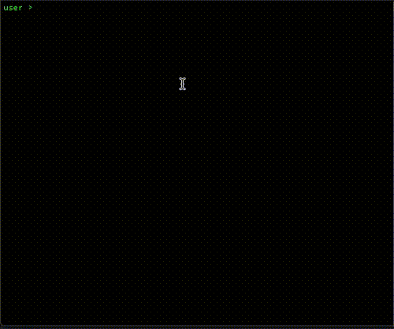

# k3sem

k3sem is a small script for automated installation of k3s cluster.
k3sem also takes care of configuring the nodes, too.

Install the OS, enable SSH. Then k3sem will do the rest.



You need to create `config.yaml` to tell k3s how to install your cluster

Example `config.yaml`
```yaml
domain: k3s.example.com

cluster:
  user: k3s
  password: <your password>
  usergroup: k3scluster
  token: my-secret-token
  nodes:
  - ip: 192.168.0.11
    hostname: k3s-node-1
    role: master
    ssh:
      user: ubuntu
      # Enable ssh login with identity file
      authorizedKey: /home/myuser/.ssh/id_rsa.pub
      privateKey: /home/myuser/.ssh/id_rsa
    raspiGpio: true

  - ip: 192.168.0.12
    hostname: k3s-node-2
    ssh:
      user: ubuntu
    raspiGpio: true

  - ip: 192.168.0.13
    hostname: k3s-node-3
    ssh:
      user: k3s
    raspiGpio: true

  - ip: 192.168.0.14
    hostname: k3s-node-4
    ssh:
      user: k3s
    raspiGpio: true

```